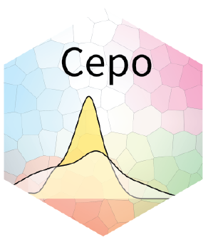

Cepo
================




[](https://codecov.io/gh/PYangLab/Cepo)


Defining the identity of a cell is fundamental to understand the
heterogeneity of cells to various environmental signals and
perturbations. We present Cepo, a new method to explore cell identities
from single-cell RNA-sequencing data using differential stability as a
new metric to define cell identity genes. Cepo computes cell-type
specific gene statistics pertaining to differential stable gene
expression.


## Installation

You can install the development version of *Cepo* that can be installed
from GitHub using the `remotes` package:

``` r
# install.packages("remotes")
remotes::install_github("PYangLab/Cepo")
```

To also build the vignettes use:

``` r
# install.packages("remotes")
remotes::install_github("PYangLab/Cepo", dependencies = TRUE,
                         build_vignettes = TRUE)
```

**NOTE:** Building the vignettes requires the installation of additional
packages.

## Documentation

The documentation for *Cepo* is available from
<http://github.com/PYangLab/Cepo>

To view the vignette and all the package documentation for the
development version visit <http://github.com/PYangLab/Cepo>.

## Citing *Cepo*

If you use *Cepo* in your work please cite our preprint ["Kim H.J., Wang
K., Yang P. Cepo uncovers cell identity through
differential stability. bioRxiv DOI:](https://www.biorxiv.org/content/10.1101/2021.01.10.426138v1).

To find all source code related to the anlayses of our preprint please refer to <http://github.com/PYangLab/CepoManuscript>.


## Developers

The following individuals were involved in developing the Cepo package:

  - \[@HaniJieunKim\](<https://github.com/HaniJieunKim>)
  - \[@kevinwang09\](<https://github.com/kevinwang09>)
  - \[@PYangLab\](<https://github.com/PYangLab>)

## Contact us

If you have any enquiries, especially about using Cepo to analyse your
data, please contact <hani.kim@sydney.edu.au>. We actively welcome any
feedback and suggestions\!
