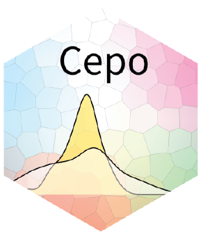

Cepo
================




[](https://codecov.io/gh/PYangLab/Cepo)


Defining the identity of a cell is fundamental to understand the
heterogeneity of cells to various environmental signals and
perturbations. We present Cepo, a new method to explore cell identities
from single-cell RNA-sequencing data using differential stability as a
new metric to define cell identity genes. Cepo computes cell-type
specific gene statistics pertaining to differential stable gene
expression.


## Installation

You can install the Bioconductor version of *Cepo* from:

``` r
if (!requireNamespace("BiocManager", quietly = TRUE))
    install.packages("BiocManager")
BiocManager::install("Cepo")
```

You can install the development version of *Cepo* from GitHub using the
`remotes` package:

``` r
# install.packages("remotes")
remotes::install_github("PYangLab/Cepo")
```

To also build the vignettes use:

``` r
# install.packages("remotes")
remotes::install_github("PYangLab/Cepo", dependencies = TRUE,
                         build_vignettes = TRUE)
```

**NOTE:** Building the vignettes requires the installation of additional
packages.

## Documentation

The documentation for *Cepo* is available from
<https://pyanglab.github.io/Cepo/>.

The Bioconductor package page is available from
<https://bioconductor.org/packages/Cepo/>.

## Citing *Cepo*

If you use *Cepo* in your work, please cite:

> Kim, H. J., Wang, K., Chen, C., Lin, Y., Tam, P. P. L., Lin, D. M.,
> Yang, J. Y. H. & Yang, P. Uncovering cell identity through differential
> stability with Cepo. *Nature Computational Science* 1, 784-790 (2021).
> <https://doi.org/10.1038/s43588-021-00172-2>

From R, you can also run:

``` r
citation("Cepo")
```

To find all source code related to the analyses of the paper, please
refer to <https://github.com/PYangLab/CepoManuscript>.


## Developers

The following individuals were involved in developing the Cepo package:

  - \[@HaniJieunKim\](<https://github.com/HaniJieunKim>)
  - \[@kevinwang09\](<https://github.com/kevinwang09>)
  - \[@PYangLab\](<https://github.com/PYangLab>)

## Contact us

If you have any enquiries, especially about using Cepo to analyse your
data, please contact <hani.kim@garvan.org.au> or
<pengyi.yang@sydney.edu.au>. We actively welcome any feedback and
suggestions\!
